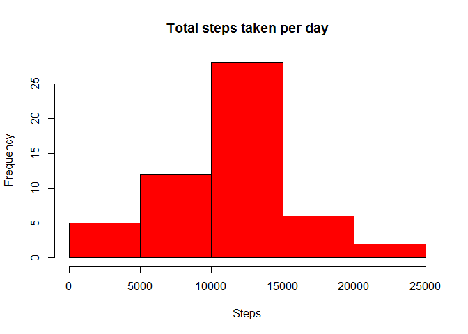
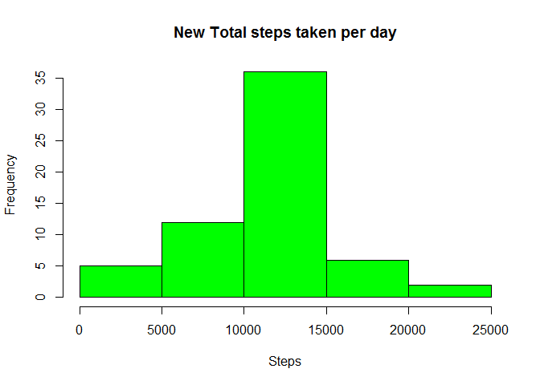

# Reproducible Research: Peer Assessment 1


## Loading and preprocessing the data
1. Load the data

```r
activityData <- read.csv("activity.csv", 
        colClasses = c("numeric","character","numeric"), 
        header=TRUE, na.strings="NA")
```

2. Process/transform the data

```r
activityData$date <- as.Date(activityData$date, format="%Y-%m-%d")
```

## What is mean total number of steps taken per day?
1. Make a histogram of the total number of steps taken each day

```r
totalSteps <- aggregate(steps ~ date, data = activityData, sum, na.rm = TRUE)

hist(totalSteps$steps, main="Total steps taken per day", 
     xlab="Steps", col="Red")
```

 

2. Calculate and report the mean and median total number of steps taken per day

```r
meanSteps <- mean(totalSteps$steps)
medianSteps <- median(totalSteps$steps)
```
The mean and median total number of steps taken per day are **1.0766 &times; 10<sup>4</sup>** and 
**1.0765 &times; 10<sup>4</sup>** respectively.

## What is the average daily activity pattern?
1. Make a time series plot (i.e. type = "l") of the 5-minute interval (x-axis) and the average number of steps taken, averaged across all days (y-axis)


```r
totalStepsInt <- aggregate(steps ~ interval, data = activityData, mean, na.rm = TRUE)

plot(totalStepsInt$interval,totalStepsInt$steps, type="l", xlab="Interval", ylab="Number of Steps",main="Average Number of Steps per Day by Interval")
```

 

2. Which 5-minute interval, on average across all the days in the dataset, contains the maximum number of steps?

```r
maxStepsInt <- totalStepsInt[which.max(totalStepsInt$steps),1]
```
The 5-minute interval, on average across all the days in the dataset, containing the maximum number of steps is **835**.

## Imputing missing values
1. Calculate and report the total number of missing values in the dataset (i.e. the total number of rows with NAs)

```r
totalNA <- sum(is.na(activityData$steps))
```
Total number of missing values in the dataset is **2304**.

2. Devise a strategy for filling in all of the missing values in the dataset. The strategy does not need to be sophisticated. For example, you could use the mean/median for that day, or the mean for that 5-minute interval, etc.

```r
totalStepsInt_w_NA <- aggregate(steps~interval, data=activityData, FUN=mean)
filler <- numeric()
for (i in 1:nrow(activityData)) {
    rec <- activityData[i, ]
    if (is.na(rec$steps)) {
        steps <- subset(totalStepsInt_w_NA, interval==rec$interval)$steps
    } else {
        steps <- rec$steps
    }
    filler <- c(filler, steps)
}
```
3. Create a new dataset that is equal to the original dataset but with the missing data filled in.

```r
newActivityData <- activityData
newActivityData$steps <- filler
```

4. Make a histogram of the total number of steps taken each day and Calculate and report the mean and median total number of steps taken per day. 

```r
newTotalSteps <- aggregate(steps~date, data=newActivityData, sum)

hist(newTotalSteps$steps, main="New Total steps taken per day", 
     xlab="Steps", col="Green")
```

 


```r
newMeanSteps <- mean(newTotalSteps$steps)
newMedianSteps <- median(newTotalSteps$steps)
```
The new mean and median total number of steps taken per day are **1.0766 &times; 10<sup>4</sup>** and 
**1.0766 &times; 10<sup>4</sup>** respectively.

Do these values differ from the estimates from the first part of the assignment? What is the impact of imputing missing data on the estimates of the total daily number of steps?

new mean: **1.0766 &times; 10<sup>4</sup>**      prev mean: **1.0766 &times; 10<sup>4</sup>**  
new median: **1.0766 &times; 10<sup>4</sup>**  prev median: **1.0765 &times; 10<sup>4</sup>**  

## Are there differences in activity patterns between weekdays and weekends?
Use the dataset with the filled-in missing values for this part.

Create a new factor variable in the dataset with two levels - "weekday" and "weekend" indicating whether a given date is a weekday or weekend day.

Make a panel plot containing a time series plot (i.e. type = "l") of the 5-minute interval (x-axis) and the average number of steps taken, averaged across all weekday days or weekend days (y-axis). 


```r
weekdays <- c("Monday", "Tuesday", "Wednesday", "Thursday", "Friday")
newActivityData$dow = as.factor(ifelse(is.element(weekdays(as.Date(newActivityData$date)),weekdays), "Weekday", "Weekend"))

newTotalStepsInt <- aggregate(steps~interval+dow,newActivityData,mean)

library(lattice)

xyplot(newTotalStepsInt$steps ~ newTotalStepsInt$interval|newTotalStepsInt$dow, main="Average Steps per Day by Interval",xlab="Interval", ylab="Steps",layout=c(1,2), type="l")
```

 
  
Based on the graphs, weekend is the time that more steps were taken.  
